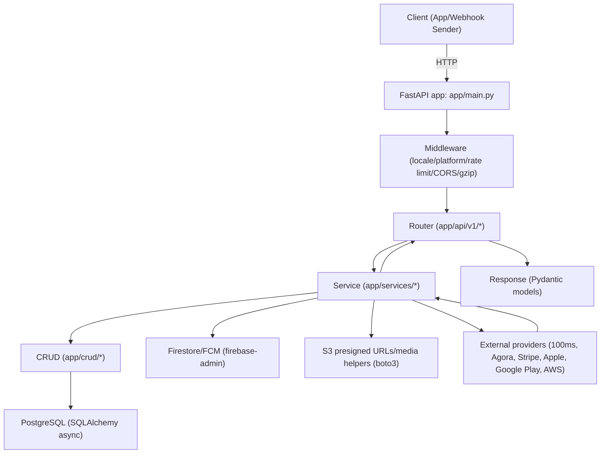

## System Overview (Backend)

This document summarizes the backend architecture, module responsibilities, inter-module data flow, main business flows, key technologies, risk/complexity hotspots, and improvement opportunities for the repository.

## Architecture Type

The system is a **single FastAPI application (monolith)** with a **layered design**:

1. **API layer** (`app/api/v1/*`)
   - HTTP endpoints (routers) and request/response models.
2. **Service layer** (`app/services/*`)
   - Business logic orchestration (validation, state transitions, calling external integrations, composing responses).
3. **CRUD / data access layer** (`app/crud/*`)
   - Entity-specific database operations and queries.
4. **Data model layer** (`app/models/*`)
   - SQLAlchemy model definitions for the PostgreSQL schema.
5. **Core/utilities** (`app/core/*`)
   - Configuration, auth/security primitives, i18n, exceptions, and shared integrations (S3 presigned URLs, Firestore/FCM helpers, AWS helpers).
6. **Infrastructure** (`app/db/*`, `initialize/*`, `jobs/*`)
   - Async DB engine/session, Redis client, AWS EventBridge initialization, scheduled job entrypoints.

Runtime entrypoint and wiring: [`app/main.py`](app/main.py).

## Runtime Entry Point & Request Wiring

[`app/main.py`](app/main.py) constructs a `FastAPI` app, registers middleware, initializes Firebase Admin SDK, and includes all API routers:

- Locale handling via [`app/api/middlewares/locale_middleware.py`](app/api/middlewares/locale_middleware.py)
- Platform detection via [`app/api/middlewares/platform_detect_middleware.py`](app/api/middlewares/platform_detect_middleware.py)
- Rate limiting via `slowapi` (configured by [`app/core/rate_limiter.py`](app/core/rate_limiter.py))
- Response/status normalization via [`app/core/utils/http_status_message_custom.py`](app/core/utils/http_status_message_custom.py)
- Validation exception handling via [`app/core/utils/validation_custom.py`](app/core/utils/validation_custom.py)
- Global exception handling that resolves language/locale via user setting when possible.

The app’s routers are included under `prefix=...` segments (e.g. `/auth`, `/users`, `/stream`, `/payment`, `/webhook`), delegating to service-layer methods.

## Module Inventory (Backend)

### API Routers (`app/api/v1/*`)

These modules expose the HTTP API surface. Responsibilities are primarily:
- Define endpoint signatures (FastAPI)
- Inject dependencies (auth context, DB session)
- Delegate business logic to the relevant service(s)

Router modules included by `app/main.py`:

1. `app/api/v1/users/auth.py` (`/auth`) — token verification and auth/logout flows.
2. `app/api/v1/users/users.py` (`/users`) — user CRUD/read/search; user “me” profile; image pre-signed URL flows.
3. `app/api/v1/users/user_ticket.py` (`/users/ticket`) — user ticket-related APIs.
4. `app/api/v1/users/user_note.py` (`/users/note`) — user notes APIs.
5. `app/api/v1/users/user_soldier_level.py` (`/users/soldier-level`) — soldier level APIs.
6. `app/api/v1/users/user_setting.py` (`/user-setting`) — user settings APIs (including language preferences).
7. `app/api/v1/lives/rooms.py` (`/rooms`) — room-related endpoints for livestream sessions.
8. `app/api/v1/lives/templates.py` (`/templates`) — livestream template endpoints.
9. `app/api/v1/users/user_follow.py` (`/follow`) — follow/unfollow queries and operations.
10. `app/api/v1/lives/streams.py` (`/stream`) — livestream listing/searching and session lifecycle operations.
11. `app/api/v1/lives/streams_twoshot_plan.py` (`/stream/twoshot-plan`) — two-shot plan endpoints.
12. `app/api/v1/lives/streams_setting.py` (`/stream/setting`) — stream setting configuration endpoints.
13. `app/api/v1/lives/streams_archive.py` (`/stream/archive`) — stream archive endpoints.
14. `app/api/v1/lives/stream_archive_comment.py` (`/stream/archive/comment`) — comments on archived streams.
15. `app/api/v1/lives/streams_mypage_archive.py` (`/stream/my-page/archive`) — user-specific archive endpoints.
16. `app/api/v1/common/common.py` (`/common`) — shared utilities endpoints (e.g., S3 presigned URL generation, invites, version).
17. `app/api/v1/users/announcement.py` (`/announce`) — announcements endpoints.
18. `app/api/v1/gift/gift_category_manager.py` (`/gift/category`) — gift category management endpoints.
19. `app/api/v1/gift/gift_manager.py` (`/gift`) — gifting-related endpoints.
20. `app/api/v1/common/webhook.py` (`/webhook`) — external webhooks (Agora, Stripe, Google Play, Apple, Tapjoy).
21. `app/api/v1/treasure/treasure.py` (`/treasure`) — treasure chest endpoints.
22. `app/api/v1/agency/agency.py` (`/agency`) — agency-related endpoints.
23. `app/api/v1/familia/familia.py` (`/familia`) — familia operations, memberships, chat/member listings.
24. `app/api/v1/familia/goal.py` (`/familia/goal`) — familia goal-related APIs.
25. `app/api/v1/title/titles.py` (`/title`) — title listing and title progression endpoints.
26. `app/api/v1/common/events.py` (`/events`) — AWS event callbacks endpoints (EventBridge-triggered).
27. `app/api/v1/report/report.py` (`/report`) — reporting endpoints.
28. `app/api/v1/post/post.py` (`/post`) — post lifecycle endpoints and list/search operations.
29. `app/api/v1/post/post_comment.py` (`/post/comment`) — post comment endpoints.
30. `app/api/v1/post/tag.py` (`/tag`) — tag lookup/search endpoints.
31. `app/api/v1/chat/chat.py` (`/chat`) — chat/conversation endpoints.
32. `app/api/v1/karaoke/karaoke.py` (`/karaoke`) — karaoke endpoints (history, ranking, requests).
33. `app/api/v1/payment/payment.py` (`/payment`) — payment bundle catalog, session creation, receipt verification.
34. `app/api/v1/users/monthly_plan.py` (`/monthly-plan`) — monthly plan/daily reward endpoints.
35. `app/api/v1/faq/faq.py` (`/faq`) — FAQ content endpoints.
36. `app/api/v1/faq/faq_category.py` (`/faq-category`) — FAQ category endpoints.
37. `app/api/v1/inquiry/inquiry.py` (`/inquiry`) — contact/inquiry endpoints.
38. `app/api/v1/music_usage_report/music_usage_report.py` (`/music-usage-report`) — music usage reporting endpoints.
39. `app/api/v1/webview/webview.py` (`/common/webview`) — webview content endpoints.
40. `app/api/v1/gacha/gacha.py` (`/gacha`) — gacha listing, detail, rolling endpoints.

### Service Layer (`app/services/*`)

Service modules implement business logic and orchestrate CRUD, DB, and external integrations. Below is the complete list found in `app/services/*` based on repository structure.

#### AWS / EventBridge

- [`app/services/aws/event_bridge_services.py`](app/services/aws/event_bridge_services.py) — create/update/delete EventBridge schedules and generate schedule names; also verifies incoming EventBridge scheduler requests.
- [`app/services/aws/event_bridge_notify_service.py`](app/services/aws/event_bridge_notify_service.py) — notification-related EventBridge helpers (invocation/callback orchestration).

#### Agora / 100ms / Live Streaming

- [`app/services/agora/agora_stream_internal_service.py`](app/services/live/agora_stream_internal_service.py) — internal Agora stream control helpers (used by livestream flows).
- [`app/services/agora/agora_cloud_record.py`](app/services/agora/agora_cloud_record.py) — manage Agora cloud recording lifecycle.
- [`app/services/agora/agora_streaming.py`](app/services/agora/agora_streaming.py) — main Agora streaming orchestration.
- [`app/services/live/agora_stream_internal_service.py`](app/services/live/agora_stream_internal_service.py) — internal Agora stream operations for live sessions.
- [`app/services/live/stream_service.py`](app/services/live/stream_service.py) — **core live stream business logic** (list/search, prepare/start/end, tokens, Firestore viewer updates, recommendations, streaks).
- [`app/services/live/room_service.py`](app/services/live/room_service.py) — room lifecycle and room-related operations.
- [`app/services/live/stream_watch_session_service.py`](app/services/live/stream_watch_session_service.py) — watch session logging (join/leave events).
- [`app/services/live/stream_setting_service.py`](app/services/live/stream_setting_service.py) — stream settings management.
- [`app/services/live/streams_archive_service.py`](app/services/live/streams_archive_service.py) — stream archive management.
- [`app/services/live/stream_twoshot_service.py`](app/services/live/stream_twoshot_service.py) — two-shot session logic.
- [`app/services/live/streams_twoshot_plan_service.py`](app/services/live/streams_twoshot_plan_service.py) — two-shot plans.
- [`app/services/live/stream_event_log.py`](app/services/live/stream_event_log.py) — stream event logging helpers.
- [`app/services/live/stream_archive_comment_service.py`](app/services/live/stream_archive_comment_service.py) — archive comment business logic.
- [`app/services/live/template_service.py`](app/services/live/template_service.py) — template-related operations.
- [`app/services/live/treasure_service.py`](app/services/live/treasure_service.py) — live stream treasure logic.

#### Auth/User Domain

- [`app/services/common/app_service.py`](app/services/common/app_service.py) — shared app utilities (cross-cutting service helpers).
- [`app/services/user/user_service.py`](app/services/user/user_service.py) — user creation, profile loading, search, invite decoding/creation, and high-level user operations.
- [`app/services/user/user_device.py`](app/services/user/user_device.py) — device token storage and related device lifecycle operations.
- [`app/services/user/user_login_history_service.py`](app/services/user/user_login_history_service.py) — login history tracking.
- [`app/services/user/user_daily_login_service.py`](app/services/user/user_daily_login_service.py) — daily login reward logic.
- [`app/services/user/user_monthly_plan.py`](app/services/user/user_monthly_plan.py) — daily reward and monthly plan logic.
- [`app/services/user/user_setting.py`](app/services/user/user_setting.py) — language and general user settings.
- [`app/services/user/user_visibility_setting.py`](app/services/user/user_visibility_setting.py) — privacy/visibility settings and block list behavior.
- [`app/services/user/user_follow.py`](app/services/user/user_follow.py) — follow relationship operations.
- [`app/services/user/user_like_service.py`](app/services/user/user_like_service.py) — likes logic and like-related data access.
- [`app/services/user/user_ranking_service.py`](app/services/user/user_ranking_service.py) — ranking queries and rank detail retrieval.
- [`app/services/user/user_reward_service.py`](app/services/user/user_reward_service.py) — reward business logic.
- [`app/services/user/user_stats_service.py`](app/services/user/user_stats_service.py) — user stats calculations and retrieval.
- [`app/services/user/user_subscription_service.py`](app/services/user/user_subscription_service.py) — subscription state management.
- [`app/services/user/user_soldier_level_service.py`](app/services/user/user_soldier_level_service.py) — soldier level state changes.
- [`app/services/user/user_soldier_level_progress_sync_service.py`](app/services/user/user_soldier_level_progress_sync_service.py) — syncing soldier progress/state.
- [`app/services/user/transaction.py`](app/services/user/transaction.py) — user transaction operations.
- [`app/services/user/user_ticket.py`](app/services/user/user_ticket.py) — ticket logic.
- [`app/services/user/user_note_service.py`](app/services/user/user_note_service.py) — notes business logic.
- [`app/services/user/user_notification_setitng.py`](app/services/user/user_notification_setitng.py) — user notification preference settings.
- [`app/services/user/user_provider_service.py`](app/services/user/user_provider_service.py) — linked provider account operations.
- [`app/services/user/user_stream.py`](app/services/user/user_stream.py) — user stream-related operations.
- [`app/services/user/user_status.py`](app/services/user/user_status.py) — user active/inactive state calculation.
- [`app/services/user/user_activity_log.py`](app/services/user/user_activity_log.py) — aggregated activity logs.
- [`app/services/user/announcement.py`](app/services/user/announcement.py) — announcement-related operations.
- [`app/services/user/user_familia.py`](app/services/user/user_familia.py) — user participation in familia.

#### Payments

- [`app/services/payment/payment_service.py`](app/services/payment/payment_service.py) — bundle listing, payment session creation, receipt verification flows.
- [`app/services/payment/payment_google_play_service.py`](app/services/payment/payment_google_play_service.py) — Google Play receipt/subscription handling.
- [`app/services/payment/payment_apple_store_service.py`](app/services/payment/payment_apple_store_service.py) — Apple receipt/subscription handling.
- [`app/services/webhook/payment_webhook_service.py`](app/services/webhook/payment_webhook_service.py) — webhook handlers for Stripe / Google Play / Apple.

#### Notifications (FCM / Firestore)

- [`app/services/notification/notification_service.py`](app/services/notification/notification_service.py) — notification routing and FCM message sending (localization + settings + device tokens).
- [`app/services/notification/message_notification_service.py`](app/services/notification/message_notification_service.py) — notification message composition and specialized messaging helpers.

#### Posts / Tags / Reports / Content

- [`app/services/post/post_service.py`](app/services/post/post_service.py) — post detail/list/recommendation logic and post state transitions.
- [`app/services/post/post_content_service.py`](app/services/post/post_content_service.py) — post content storage/updates (media handling).
- [`app/services/post/post_comment_service.py`](app/services/post/post_comment_service.py) — comment logic.
- [`app/services/post/post_tags_service.py`](app/services/post/post_tags_service.py) — tag assignment for posts.
- [`app/services/tag/tag_service.py`](app/services/tag/tag_service.py) — tag query/search logic.
- [`app/services/report/report.py`](app/services/report/report.py) — reporting endpoints and report submission logic.

#### Gacha / Karaoke / Gifts / Fragments / FAQ / Inquiry

- [`app/services/gacha/gacha_service.py`](app/services/gacha/gacha_service.py) — gacha list/detail/roll orchestration.
- [`app/services/karaoke/karaoke_song_service.py`](app/services/karaoke/karaoke_song_service.py) — karaoke song management and scoring histories.
- [`app/services/gift/gift_service.py`](app/services/gift/gift_service.py) — gifts and wishlist handling.
- [`app/services/gift/gift_category_service.py`](app/services/gift/gift_category_service.py) — gift category logic.
- [`app/services/fragment/fragment_service.py`](app/services/fragment/fragment_service.py) — fragment-related operations.
- [`app/services/faq/faq_service.py`](app/services/faq/faq_service.py) — FAQ detail/list.
- [`app/services/faq/faq_category_service.py`](app/services/faq/faq_category_service.py) — FAQ categories.
- [`app/services/inquiry/inquiry_service.py`](app/services/inquiry/inquiry_service.py) — user inquiry/contact processing.

#### Familia (Group/Community)

- [`app/services/familia/familia_service.py`](app/services/familia/familia_service.py) — familia operations and permissions.
- [`app/services/familia/familia_class_service.py`](app/services/familia/familia_class_service.py) — class/subscription flows for familia.
- [`app/services/familia/familia_member_service.py`](app/services/familia/familia_member_service.py) — familia membership management and member lists.
- [`app/services/familia/familia_chat_service.py`](app/services/familia/familia_chat_service.py) — familia chat member queries and related utilities.
- [`app/services/familia/familia_goal_service.py`](app/services/familia/familia_goal_service.py) — familia goal tracking.
- [`app/services/familia/familia_subscription.py`](app/services/familia/familia_subscription.py) — subscription package management within familia.
- [`app/services/familia/familia_stamps_service.py`](app/services/familia/familia_stamps_service.py) — stamps reward/points logic.

#### Leaderboards / Missions / Music Usage

- [`app/services/leaderboard/leaderboard_service.py`](app/services/leaderboard/leaderboard_service.py) — leaderboard/rank computations.
- [`app/services/mission/user_mission_service.py`](app/services/mission/user_mission_service.py) — mission tracking and completion logic.
- [`app/services/music_usage_report/music_usage_report_service.py`](app/services/music_usage_report/music_usage_report_service.py) — music usage reporting processing.

#### Webview

- [`app/services/webview/webview_service.py`](app/services/webview/webview_service.py) — webview content retrieval and locale-aware path building.

#### Webhooks (non-payment)

- [`app/services/webhook/agora_webhook_service.py`](app/services/webhook/agora_webhook_service.py) — Agora webhook handler with Firestore idempotency locks.
- [`app/services/webhook/payment_webhook_service.py`](app/services/webhook/payment_webhook_service.py) — payment provider webhook handler(s).

#### Wallets / Points

- [`app/services/wallets/wallets_service.py`](app/services/wallets/wallets_service.py) — wallet and coin/point update logic.

#### Tapjoy / External Reward Ads

- [`app/services/tapjoy/tapjoy_service.py`](app/services/tapjoy/tapjoy_service.py) — Tapjoy reward callback handling.

#### Agency / Community Management

- [`app/services/agency/agency_service.py`](app/services/agency/agency_service.py) — agency endpoints and operations.

> Note: The service list above mirrors the repository’s `app/services/*` package structure. CRUD and model modules are numerous and follow the same entity-per-file convention.

### Core Utilities (`app/core/*`)

Key responsibilities:

- [`app/core/config.py`](app/core/config.py) — environment/configuration loading via `.env` and pydantic-settings.
- [`app/core/security.py`](app/core/security.py) — token verification + password hashing utilities + token blacklist integration.
- [`app/core/context.py`](app/core/context.py) — request-scoped context via `contextvars` (locale/platform/user id).
- [`app/core/i18n.py`](app/core/i18n.py) — message translation and locale selection.
- [`app/core/utils/function.py`](app/core/utils/function.py) — S3 presigned URL generation, AWS EventBridge client helpers, media resizing helpers.
- [`app/core/utils/firebase_firestore.py`](app/core/utils/firebase_firestore.py) — Firestore/FirestoreService CRUD helpers.
- [`app/core/utils/firebase_functions.py`](app/core/utils/firebase_functions.py) — additional Firebase helper wrappers (if present).
- [`app/core/events.py`](app/core/events.py) — declarative EventBridge “bridges” and event definitions for AWS routing.

### Database / Infrastructure (`app/db/*`, `initialize/*`, `jobs/*`)

- [`app/db/database.py`](app/db/database.py) — async SQLAlchemy engine + `async_get_db` session dependency.
- [`app/db/cache.py`](app/db/cache.py) — Redis client wrapper used for caching and set/hash operations.
- [`initialize/events.py`](initialize/events.py) — initialize EventBridge resources at startup/import time.
- [`jobs/ranking_schedule.py`](jobs/ranking_schedule.py) — scheduled job entrypoint to compute user ranks from revenue.

## Data Flow Between Modules

### General Request/Response Flow

### Auth and User Context Flow

1. Router endpoints require the current user via dependency `get_current_user` from [`app/api/dependencies.py`](app/api/dependencies.py).
2. `get_current_user` uses `oauth2_scheme` (`CustomHTTPBearer`) to extract the bearer token.
3. It calls `verify_token` in [`app/core/security.py`](app/core/security.py), which:
   - checks token blacklist (`crud_token_blacklist`)
   - verifies token identity
   - resolves the user via `UserService.get_user_by_uid`
   - updates user deletion handling and EventBridge schedules when needed
4. The dependency sets `current_user_id` in [`app/core/context.py`](app/core/context.py) and also upserts daily login history (`UserLoginHistoryService`).
5. Device token persistence is handled in the auth endpoints themselves:
   - For example, `/auth/verify-token` (`app/api/v1/users/auth.py`) stores `data.device_token` via `UserDeviceService.set_user_device(...)` when provided.
6. The endpoint receives a `UserRead` model and calls the relevant service(s).

### Payment Sessions + Provider Webhooks Flow

HTTP endpoints:
- Payment session creation via [`app/api/v1/payment/payment.py`](app/api/v1/payment/payment.py) delegating to [`app/services/payment/payment_service.py`](app/services/payment/payment_service.py).
- Webhooks via [`app/api/v1/common/webhook.py`](app/api/v1/common/webhook.py) delegating to [`app/services/webhook/payment_webhook_service.py`](app/services/webhook/payment_webhook_service.py).

Main steps (Stripe shown; similar patterns for Apple/Google):
1. Client calls `/payment/create-session/...`
2. `PaymentService.create_payment_session`:
   - loads bundle via CRUD
   - creates/ensures Stripe product/price metadata
   - calls Stripe to create a checkout session
   - records a Stripe event history row and a `TopUp` row in PostgreSQL
3. Provider webhook arrives at `/webhook/payment/stripe/`
4. `PaymentWebhookService.handle_stripe_event`:
   - verifies signature using `stripe_util`
   - marks the stripe event history as processed
   - marks the top-up as `COMPLETED`/`FAILED`
   - credits wallet points via [`app/services/wallets/wallets_service.py`](app/services/wallets/wallets_service.py)

### Livestream (100ms + Firestore + Agora) Flow

HTTP endpoints:
- Livestream listing/searching/session prep in [`app/api/v1/lives/streams.py`](app/api/v1/lives/streams.py) -> [`app/services/live/stream_service.py`](app/services/live/stream_service.py)
- Room/session management in [`app/api/v1/lives/rooms.py`](app/api/v1/lives/rooms.py) -> [`app/services/live/room_service.py`](app/services/live/room_service.py)
- Viewing-related transitions and tokens in `StreamService` methods.

Agora webhook:
- Webhook endpoints under `/webhook/agr/...` in [`app/api/v1/common/webhook.py`](app/api/v1/common/webhook.py)
- Agora processing in [`app/services/webhook/agora_webhook_service.py`](app/services/webhook/agora_webhook_service.py)

Main steps:
1. User requests a livestream list/search:
   - `StreamService` calls the 100ms Live API (token managed via `Live100msUtils`), then enriches with DB room/user information via CRUD.
2. User prepares to livestream:
   - `StreamService.prepare_stream` creates DB stream/room state and generates necessary tokens.
3. Agora delivers channel join/leave and SRT stream events:
   - `AgoraWebhookService.handle` acquires a Firestore idempotency lock (`firestore_service.acquire_idempotent_lock`) keyed by `notice_id`.
   - For join/leave events, it consults `StreamWatchSessionService` and `StreamService`/internal Agora services to update state and write watch logs.
4. For disconnect/timeouts, `AgoraWebhookService` may schedule next-stream events via [`app/services/aws/event_bridge_services.py`](app/services/aws/event_bridge_services.py).
5. Notifications are dispatched via [`app/services/notification/notification_service.py`](app/services/notification/notification_service.py) when events require user-facing push notifications.

## Main Business Flows (Backend)

### 1. User Lifecycle & Daily Rewards

1. User registers or is created via user endpoints -> `UserService.create_user`:
   - Validates profile constraints (e.g., age check)
   - Creates SQL user row via CRUD
   - Creates wallet, familia, default chat group
   - Creates provider links when applicable
   - Writes a Firestore user document via `firestore_service.create_document(...)`
2. Authenticated requests use `get_current_user` dependency:
   - token verification
   - sets context vars
   - upserts daily login history (`UserLoginHistoryService`)
3. Daily reward endpoints are served by:
   - `UserMonthlyPlanService.claim_daily_reward` (invoked during verify-token and by auth flow)
   - `UserDailyLoginService.check_and_reward_daily_login`

### 2. Livestream Session Lifecycle

1. List/search streams: `StreamService.get_streams/search_streams`.
2. Prepare livestream: `StreamService.prepare_stream`.
3. Prepare viewer join:
   - `StreamService.prepare_view_stream`
   - `StreamService.viewer_join`
4. Real-time state consistency:
   - Agora webhook events update watch-session logs and viewer private stream state in `AgoraWebhookService`.
   - StreamService handles private/public transitions and calculates viewer counts and session termination behavior.

### 3. Posts and Notifications

1. Create post:
   - `PostService.create_post` creates `Post`, post tags, settings, post contents.
   - If post is `PUBLIC`, it triggers notifications to followers via `NotificationService.push_notification_batch`.
   - If scheduled, it schedules callbacks through `EventBridgeServices.notify_callback`.
2. Read post detail:
   - `PostService.get_post_by_id` loads settings/tags/contents and counts likes/comments.
   - It applies access rules using visibility settings and post comment rules.

### 4. Payments and Wallet Credit

1. Payment catalog and session creation:
   - `PaymentService.get_available_bundles`
   - `PaymentService.create_payment_session`
2. Provider completion:
   - Stripe webhook -> `PaymentWebhookService.handle_stripe_event`
   - Apple/Google -> `handle_applestore_event` / `process_googleplay_event`
3. Wallet credit:
   - `WalletsService.add_gift_point_to_wallet`
   - Payment status and processed flags are stored for idempotency-like behavior.

### 5. Push Notifications (FCM) with Localization

1. `NotificationService` checks per-event user notification settings (`UserNotificationSetting`) and blocks.
2. It fetches user language preferences (`UserSettingService`).
3. It loads device tokens (`UserDeviceService.get_devices_by_user_id`).
4. It sends localized FCM messages via `firebase_admin.messaging`:
   - `messaging.Message` / `MulticastMessage`

## Key Technologies Used

Backend/framework:
- FastAPI (`app/main.py`, `app/api/v1/*`)
- Uvicorn (`uvicorn[standard]` in dependencies)

Data:
- PostgreSQL
- SQLAlchemy async (`sqlalchemy.ext.asyncio`, `app/db/database.py`)
- Pydantic and Pydantic settings (`pydantic-settings`)
- Alembic (`alembic`, `alembic.ini`)

Caching / rate limiting:
- Redis (`redis[hiredis]`, `app/db/cache.py`)
- slowapi (`slowapi`) for request rate limiting

External integrations:
- Firebase Admin SDK:
  - Auth (`firebase_admin.auth`)
  - Firestore (`firebase_admin.firestore`)
  - FCM push messaging (`firebase_admin.messaging`)
- AWS:
  - EventBridge Scheduler + Events (via `boto3`)
  - S3 presigned URLs and media helpers (via `boto3`)
- Live streaming:
  - 100ms Live API (`100ms` utilities in `app/core/utils/live100ms.py`)
  - Agora webhooks and cloud recording (`AgoraWebhookService`, `agora_*` services)
- Payments:
  - Stripe (`stripe_util`)
  - Apple In-App Purchases (`appstoreserverlibrary`, `requests` to Apple verify endpoints)
  - Google Play Developer API (`googleapiclient.discovery` with service account)
- Misc:
  - Babel-like tooling for localization (`babel`)
  - Stripe + Apple + Google flows are implemented synchronously/async-mixed; external calls are common in services.

Testing and dev tooling:
- pytest
- pre-commit

## Risky / Complex Parts

### 1. Livestream Core (`app/services/live/stream_service.py`)

- Extremely large and stateful service coordinating 100ms calls, DB reads/writes, Firestore updates, and access rules.
- High chance of performance regressions, correctness bugs, and tight coupling between external systems and business state.
- File: [`app/services/live/stream_service.py`](app/services/live/stream_service.py)

### 2. Agora Webhook Idempotency and Event Handling (`app/services/webhook/agora_webhook_service.py`)

- Webhook handler relies on Firestore idempotency locks keyed by Agora `notice_id`.
- Correctness depends on lock acquisition/release behavior and on mapping event types to state transitions.
- File: [`app/services/webhook/agora_webhook_service.py`](app/services/webhook/agora_webhook_service.py)

### 3. Payment Webhooks Security & Idempotency (`app/services/webhook/payment_webhook_service.py`)

- Stripe signature verification is present via `stripe_util.verify_webhook_signature`, but idempotency depends on `processed` flags in event-history tables.
- Google Play uses Pub/Sub decoding and hardcoded service-account filename (`service-account.json`) in the webhook handler, which is environment-sensitive.
- File: [`app/services/webhook/payment_webhook_service.py`](app/services/webhook/payment_webhook_service.py)

### 4. Auth Token Verification Consistency (`app/core/security.py`, [`app/api/dependencies.py`](app/api/dependencies.py))

- Token verification logic includes both JWT creation (via `jose.jwt.encode`) and Firebase ID token verification (`firebase_admin.auth.verify_id_token`) inside the same code path.
- The mismatch between “JWT semantics” and “Firebase ID token verification” could lead to subtle auth bugs or incorrect expectations across endpoints.
- Files:
  - [`app/core/security.py`](app/core/security.py)
  - [`app/api/dependencies.py`](app/api/dependencies.py)

### 5. Locale Middleware Reads & Logs Request Body (`app/api/middlewares/locale_middleware.py`)

- `LocaleMiddleware` calls `await request.body()` and logs the entire body.
- This can leak sensitive user data into logs and introduces overhead. It may also affect performance or request-handling assumptions.
- File: [`app/api/middlewares/locale_middleware.py`](app/api/middlewares/locale_middleware.py)

### 6. EventBridge Initialization at Import Time (`initialize/events.py`)

- `initialize/events.py` calls `init_events()` at module import time.
- This can cause side effects during application startup and makes behavior harder to control (especially in tests or local environments).
- File: [`initialize/events.py`](initialize/events.py)
- Supporting definitions: [`app/core/events.py`](app/core/events.py), [`app/services/aws/event_bridge_services.py`](app/services/aws/event_bridge_services.py)

### 7. Production Logging / Blocking Calls

- Some services contain `print(...)` statements during query compilation (e.g., notification queries), which can create noisy logs and slow down request handling.
- Several S3 operations and media resizing utilities are called from request paths; if they are blocking, they can reduce throughput.
- Files (examples):
  - [`app/services/notification/notification_service.py`](app/services/notification/notification_service.py)
  - [`app/core/utils/function.py`](app/core/utils/function.py)

### 8. Cross-System Data Consistency (Postgres + Firestore)

- Many business flows write state both to PostgreSQL and to Firestore.
- Without distributed transactions, the system is eventually consistent; failures between steps can leave partial state unless compensating logic exists.
- Files:
  - Firestore helpers: [`app/core/utils/firebase_firestore.py`](app/core/utils/firebase_firestore.py)
  - Examples in services: user creation (`UserService.create_user`), stream watch/session updates, notifications logic.

## Suggested Improvements

### Security and Auth Hardening

1. Make token verification semantics explicit:
   - Decide whether bearer tokens are “JWT created by this service” or “Firebase ID tokens”.
   - Implement separate verification methods and ensure endpoints use the correct one.
   - Files: [`app/core/security.py`](app/core/security.py), [`app/api/v1/users/auth.py`](app/api/v1/users/auth.py)
2. Remove request body logging from locale middleware and avoid reading the body in middleware:
   - Prefer determining locale from headers or auth-derived settings after token verification.
   - File: [`app/api/middlewares/locale_middleware.py`](app/api/middlewares/locale_middleware.py)
3. Strengthen webhook signature validation:
   - For AWS EventBridge scheduler callbacks, use a proper HMAC signature scheme (not “header equals secret key”).
   - For third-party providers, enforce replay protection where possible.
   - File: [`app/services/aws/event_bridge_services.py`](app/services/aws/event_bridge_services.py)

### Operational Safety / Initialization

1. Avoid side effects on import:
   - Convert `initialize/events.py` to expose an explicit CLI entrypoint (e.g., `python -m initialize.events`) and remove `init_events()` from import-time execution.
   - File: [`initialize/events.py`](initialize/events.py)

### Observability

1. Add request correlation IDs and structured logging:
   - Include user id, endpoint, event id / notice id, and external provider type.
2. Instrument external calls (100ms/Agora/Stripe/Apple/Google/Firebase) with timings, error rates, and retries.

### Performance and Maintainability

1. Refactor `StreamService` into smaller domain services:
   - Separate concerns: token generation, state transitions, Firestore viewer document updates, recommendation calculation, and streak tracking.
2. Audit blocking calls in async request handlers:
   - Use async HTTP clients where possible and move heavy work into background tasks.
3. Remove `print(...)` and any debug SQL compilation from hot paths.
   - File: [`app/services/notification/notification_service.py`](app/services/notification/notification_service.py)

### Test Strategy

Add targeted tests for the highest-risk flows:
- Auth verification + token blacklist behavior.
- Stripe webhook idempotency (`processed` flags and correct wallet credit).
- Firestore idempotent lock behavior in Agora webhook handler.
- A minimal end-to-end livestream lifecycle simulation (prepare stream -> webhook join/leave -> status update).

## Appendix: Notable Entry Points

- Server start: `uvicorn app.main:app --reload` (from [`README.md`](README.md))
- Scheduled job: [`jobs/ranking_schedule.py`](jobs/ranking_schedule.py)
- EventBridge resource initialization: [`initialize/events.py`](initialize/events.py)

